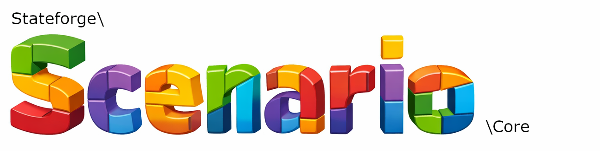

---

# Scenario Core
Scenario Core is a declarative, attribute-driven framework for reproducible data states in PHP.
It replaces manual test setup and fixture orchestration with structured, metadata-based scenario
execution.

## Requirements
Scenario Core requires the following:
- PHP >= 8.2.
- ext-dom *
- [phpunit/phpunit](https://github.com/sebastianbergmann/phpunit) >= 11

## Installation

> This package is intended for test and development use only.

Install it via Composer as a development dependency.
```bash
composer require --dev stateforge/scenario-core
```

## PHPUnit Integration
It integrates seamlessly with PHPUnit-based test suites and console tooling.
To enable scenario processing in your test suite, register the PHPUnit
extension in your ``phpunit.xml``:

```xml
<extensions>
    <bootstrap class="Stateforge\Scenario\Core\PHPUnit\Extension" />
</extensions>
```

The extension integrates with the PHPUnit lifecycle and ensures
that all scenario-related attributes are processed before test
execution.

## Defining a Scenario
A scenario represents a reproducible application data state.
Scenarios:
- Implement ``ScenarioInterface``
- Are marked with ```#[AsScenario]```
- Are automatically discovered and registered

```php
use Stateforge\Scenario\Core\Attribute\AsScenario;
use Stateforge\Scenario\Core\Contract\ScenarioInterface;

#[AsScenario('my-scenario')]
final class MyScenario implements ScenarioInterface
{
    public function up(): void
    {
        // load some data
    }

    public function down(): void
    {
        // remove loaded data
    }
}
```
No manual registry interaction is required.

## Applying a Scenario in a Unit Test
Scenarios can be applied declaratively using the ```#[ApplyScenario]``` attribute:

```php
use Stateforge\Scenario\Core\Attribute\ApplyScenario;

#[ApplyScenario('my-scenario')]
final class MyTest extends TestCase
{
    #[ApplyScenario('my-second-scenario')]
    public function testSomethingImportant(): void
    {
        // scenario has already been applied, data can be tested
    }
}
```
Multiple scenarios may be applied at class or method level. A scenario class can apply other scenarios.

## Example Use Case
```php
#[ApplyScenario(UserExists::class, [ 'id' => 42 ])]
#[ApplyScenario(UserHasSubscription::class, [ 'id' => 42 ])]
final class SubscriptionTest extends TestCase
{
    public function testUserHasAccess(): void
    {
        // system is already in the desired state
        $this->assertTrue($this->service->userHasAccess(42));
    }
}
```

## Resetting the Database
Use the ```#[RefreshDatabase]``` attribute to reset the database before scenario execution:

```php
use Stateforge\Scenario\Core\Attribute\RefreshDatabase;

#[RefreshDatabase]
final class MyFreshDatabaseTest extends TestCase
{
}
```

This ensures clean and deterministic test state. This can be applied on class or method
level and on Unit Tests or Scenario Classes.

>The ``#[RefreshDatabase]`` attribute triggers a database reset hook.
>Scenario Core itself does not implement database logic, as it remains framework-agnostic.
>Instead, a custom PHP file can be configured to perform the reset according to your application's infrastructure.

## Console Usage
Scenarios can also be executed directly from the console:
```bash
php vendor/bin/scenario apply my-scenario
```

This allows:
- local state setup
- reproducible development fixtures
- CI preparation workflows

Get all available CLI Commands:
```bash
php vendor/bin/scenario
```

## Framework Integration
Scenario Core is framework-agnostic and can be integrated into any PHP application.

It works particularly well with:
- Symfony-based applications: ([stateforge/scenario-symfony](https://github.com/laloona/scenario-symfony))
- Laravel-based applications: ([stateforge/scenario-laravel](https://github.com/laloona/scenario-laravel))
- Custom test infrastructures using PHPUnit

Framework-specific integration layers may be provided separately.

## Next Steps

- [Getting Started](docs/getting-started.md)
- [Configuration](docs/configuration.md)
- [Scenarios](docs/scenarios.md)
- [Parameter Types](docs/parameter-types.md)
- [CLI Usage](docs/cli.md)
- [Testing with PHPUnit](docs/testing-with-phpunit.md)
- [Recipes](docs/recipes.md)
